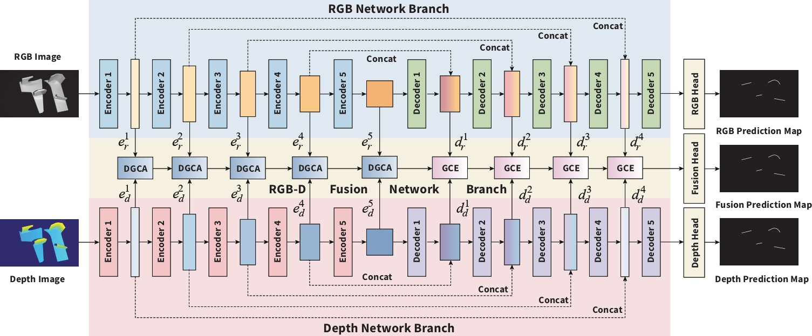
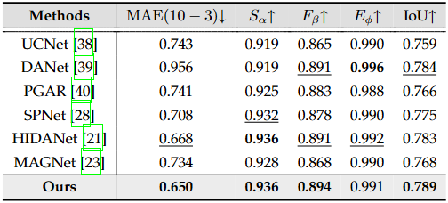
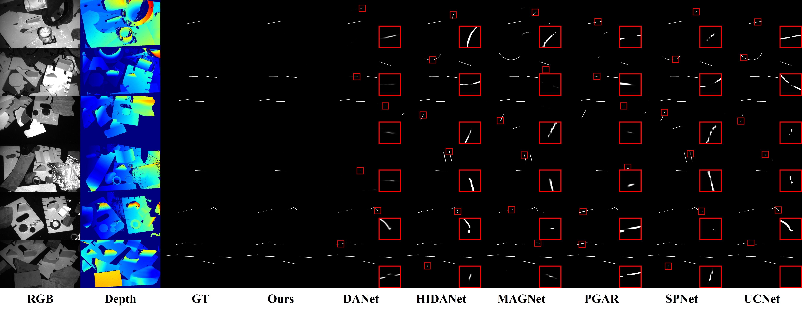

# Automated Weld Seam Detection System Based on the Fusion of RGB-D Images
> **Authors:**
> [*Zijian Wu*]
> [*Ziqiang Wang*]
> [*Ju Lu*]
> [*Jing Han*]
> [*Lianfa Bai*]
> [*Yi Zhang*]
> and [*Zhuang Zhao*]

## 1. Preface

- This repository provides code for "_**Automated Weld Seam Detection System Based on the Fusion of RGB-D Images**_" 

## 2. Overview

### 2.1. Introduction

Automatic weld seam detection is a cornerstone of intelligent manufacturing, yet its advancement is severely impeded by the scarcity of high-quality 3D annotated data and the complex topology of weldments in cluttered industrial environments. To address the data acquisition bottleneck, we construct the first large-scale RGB-D weld seam detection benchmark. By leveraging 3D printing technology to synthesize large-tonnage marine weldment prototypes and employing stereo structured-light measurement for high-fidelity 3D reconstruction, this dataset bridges the gap between theoretical models and physical constraints. Methodologically, we propose a novel geometry-aware framework tailored for the thin, elongated morphology of weld seams. Specifically, a Depth Guidance Cross-modal Attention Module (DGCA) is designed to utilize depth maps as spatial attention priors, effectively suppressing background noise at the encoding stage. Complementarily, a Graph-based Cross-modal Enhancement Module (GCE) introduces graph-based interactions to model non-local geometric dependencies, thereby refining structural reasoning during decoding. Extensive experiments demonstrate that our approach significantly outperforms state-of-the-art general RGB-D segmentation methods. Notably, it exhibits superior robustness against environmental interference and demonstrates remarkable label efficiency in data-constrained regimes, offering a scalable solution for real-world industrial deployment.

### 2.2. Framework Overview

      
    <em> 
    Figure 1: Overview of our geometry-aware automatic weld seam detection method.
    </em>

### 2.3. Quantitative Results

      

### 2.4. Qualitative Results

      
    <em> 
    Figure 2: Visual comparisons of our method and six state-of-the-art methods.
    </em>

## 3. Proposed Baseline

### 3.1. Training/Testing

The training and testing experiments are conducted using [PyTorch](https://github.com/pytorch/pytorch) with one NVIDIA 3090 GPU with 24 GB memory.

1. Configuring your environment (Prerequisites):
    
    + Installing necessary packages: `pip install -r requirements.txt`.

1. Obtatining necessary data and weights:

    + To obtain the necessary training and testing data, please contact zhaozhuang@njust.edu.cn and move it into `./Data/`.
   
    + To obtain the pretrained weights, please contact zhaozhuang@njust.edu.cn and move it into `./Checkpoint/RGBDNet/`.

    

1. Train Configuration:

    + After you obtained training dataset, just run `train.py` to train our model.
    

1. Test Configuration:

    + After you obtained all the pre-trained model and testing dataset, just run `test_produce_maps.py` to generate the final prediction map, then run `test_evaluation_maps.py` to obtain the final quantitative results. 
    
    
### 3.2 Evaluating your trained model:

Our evaluation is implemented by python, please refer to `test_evaluation_maps.py`

**[⬆ back to top](#0-preface)**

